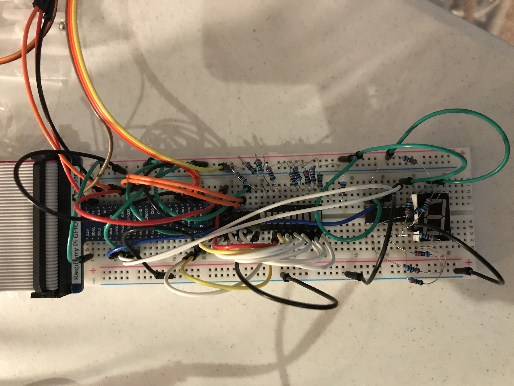

# theforce-pi
raspi project, ultrasonic sensor, LED bar graph, 7-segment display and a servo motor

this project will use an ultrasonic sensor to detect hand movement, will control a LED bar graph based on distance.
when the hand is at a particular distance it will start to count down a 7-segment display and at zero will release
a trigger controlled via a servo motor.

  
  
  

